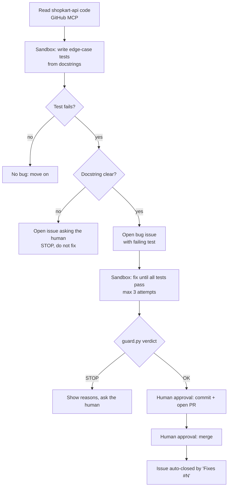

# Architecture

Bug Hunter runs on the TrueForge agent harness. The model decides what to do; TrueForge executes it through the GitHub MCP server and the Daytona sandbox, and pauses for a human before anything changes `main`.

## Components

| Component | Role |
| --- | --- |
| TrueForge | Agent harness: runs the agent loop, holds the GitHub token, enforces approval shields |
| GitHub MCP server | The agent's access to the real system: read code, open issues, branches, PRs, merge |
| Daytona sandbox | Isolated machine where generated tests and fixes run; holds no secrets |
| `guard/guard.py` | Deterministic stop rules checked before any PR |
| OpenAI model | Reasons about the code and decides the next tool call |

## Why the sandbox never clones the repo

Secrets stay in the harness. The sandbox has no GitHub token, so the agent reads files through the GitHub MCP tools and writes them into the sandbox. Even if generated code misbehaves, it cannot reach our credentials.
